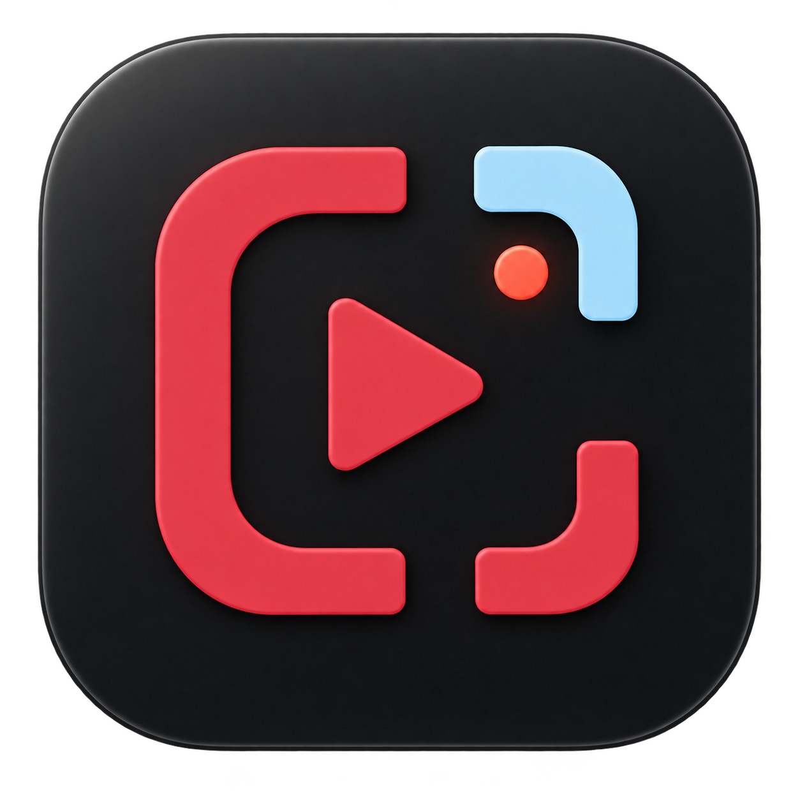

# Capturely

<p align="center">
  
</p>

Capturely is a native macOS replay clipping app for games. The MVP targets macOS 26 and records configured game windows into a local replay buffer.

## Install

```bash
brew tap Italian-seasoning/tap
brew install --cask capturely
```

Capturely checks the signed [Sparkle](https://sparkle-project.org) release feed automatically. You can also choose **Check for Updates…** from the menu bar.

## Run

```bash
./script/build_and_run.sh
```

For live capture QA, prefer launching with this script instead of alternating
between Xcode DerivedData builds and `dist/Capturely.app`. Screen Recording
permission is stored against the signed app identity, so one stable launch path
keeps permission prompts predictable.

If you build from Xcode, use Xcode for editing, tests, and build errors, then
launch the signed app with `./script/build_and_run.sh` for ScreenCaptureKit
runtime QA. Xcode's default SwiftPM Run action launches a different build
product than `dist/Capturely.app`, so macOS can show a separate Screen Recording
permission entry even when the signed Capturely app is already approved.

`build_and_run.sh` signs the finished app bundle. If no certificate-backed code
signing identity is available, it falls back to ad-hoc signing and prints a
warning because macOS may ask for Screen Recording permission again after code
changes. Set `CAPTURELY_CODE_SIGN_IDENTITY` to an Apple Development, Developer
ID, or local code signing identity to keep permission approval stable across
rebuilds.

To create a local-only signing identity for Capturely development:

```bash
./script/create_local_signing_identity.sh
CAPTURELY_CODE_SIGN_IDENTITY="Capturely Local Development" ./script/build_and_run.sh
```

## Verify

```bash
xcodebuild -workspace .swiftpm/xcode/package.xcworkspace -scheme Capturely build
xcodebuild -workspace .swiftpm/xcode/package.xcworkspace -scheme Capturely test
./script/build_and_run.sh --verify
```

## Release

Push a `v*` tag to run the signed, notarized GitHub release workflow. Configure the repository secrets listed in [the workflow](.github/workflows/release.yml), then set the `RELEASE_AUTOMATION_ENABLED` repository variable to `true`.

## Local Clip Folder

Capturely saves clips under:

```text
~/Movies/Capturely/Clips/<Game>/<Date>/<Time>/
```

Each saved clip folder contains `clip.mov` and `metadata.json`. When editable audio is enabled and more than one source is captured, it also contains `editable-source.mov` with ordered app and microphone tracks.

The library supports search, game/star/date filters, clip titles, tags, native sharing, and Original/1080p/720p exports. In Settings, add up to four running apps under Isolated App Tracks; Capturely records those apps separately instead of the broad system mix, while keeping the microphone on its own track. The clip editor provides mute, solo, and gain controls for each preserved track.

## Appearance and reaction clips

Choose Daylight (white, red, and ice blue), Harbor, Neon, or Graphite in Settings. The compact in-game overlay opens from the top-left and collapses in height before fading, with a light sweep and support for Reduce Motion.

Automatic reaction clipping uses the microphone level, a configurable threshold, and a cooldown. It requires microphone permission, an enabled microphone, and a running replay buffer. The microphone meter in Settings shows the input level.

## Discord Rich Presence

Enable the local presence bridge in Capturely Settings. The opt-in bridge serves capture activity on `127.0.0.1:48731`, without clip paths or window titles. The companion Vencord plugin is in [integrations/vencord/EnhancedPresence](integrations/vencord/EnhancedPresence). Copy that directory into a Vencord source checkout's `src/userplugins`, build Vencord, and enable EnhancedPresence. Enter your own Discord application ID in the plugin settings; presence remains unpublished until one is configured.

This integration provides Capturely activity. The broader universal EnhancedPresence engine is not included.
